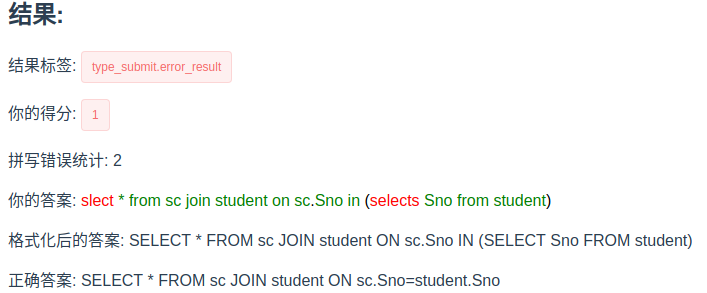
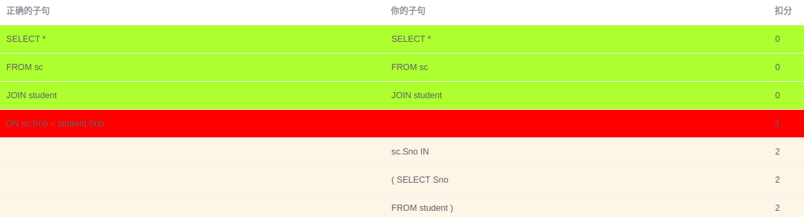
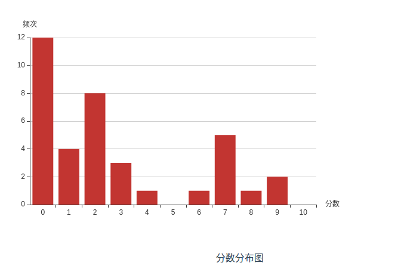
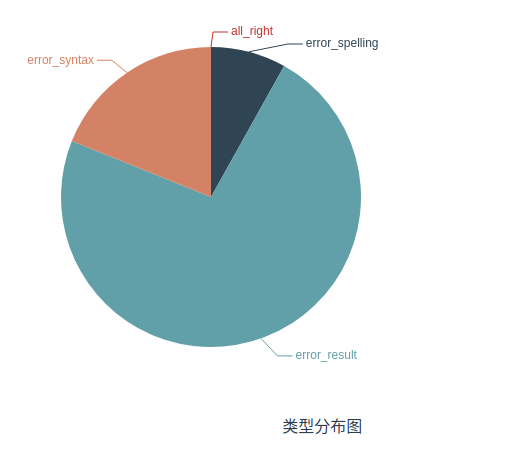
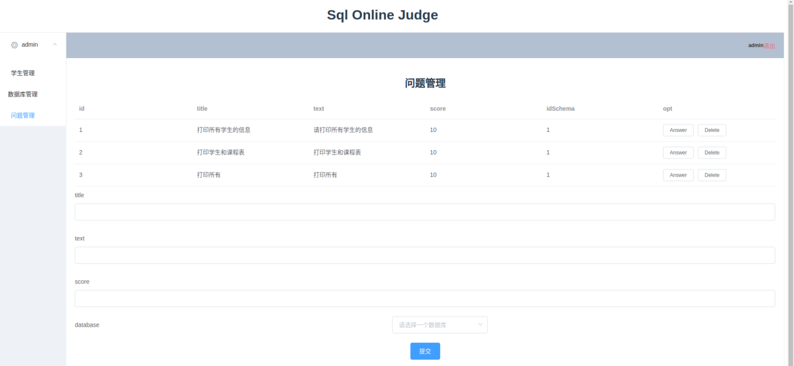

# Sql-Online-Judge

数据库机试评分系统

## 开发技术

本系统采用B/S架构，使用Python的flask库，前端采用Vue框架。
开发工具：使用pycharm作为Python的IDE，使用webstorm和vscode作为Vue的IDE。

前端：Vue作为主体框架，Vuex作为状态存储，Axios作为与后端进行HTTP通信的库，ElementUI作为美化页面的框架，Echarts用于画统计图，vue-router用于提供前端路由功能。

后端：Flask作为主体框架，flask_restful提供RESTful API风格的基础框架，SqlAlchemy作为后端ORM框架，sqlparse用于格式化SQL代码，moz_sql_parser用于实现SQL分句，sqlite作为练习用数据库。MySQL作为系统数据库，Levenshtein用于计算字符串的相似度。

## 特点

评分不只是判断对错, 在学生答案部分正确时也要能给出相应的部分分数, 使得评分更加人性化.

例子:

## 原理

将学生答案和正确答案都进行分割字句处理, 在学生运行在数据库中结果不正确时, 通过子句对比给出部分分数.

例子:

## others

### 统计图

### 管理页面

